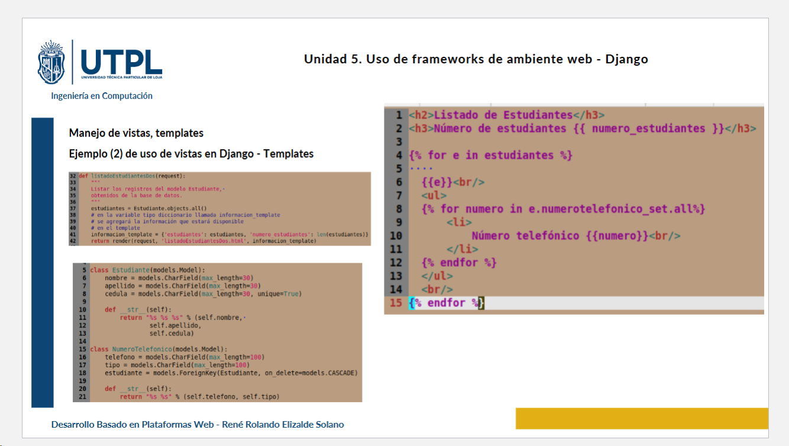

# clase03-2bim

1️⃣ Desde cada estudiante
📌 ¿Cómo funciona?
mis_numeros_telefonicos es el related_name definido en el modelo NumeroTelefonico, lo que permite acceder a los números telefónicos de cada estudiante directamente.

2️⃣ Desde la consulta general
📌 ¿Cómo funciona?
mis_numeros_telefonicos es una lista independiente que contiene todos los números telefónicos de la base de datos.
